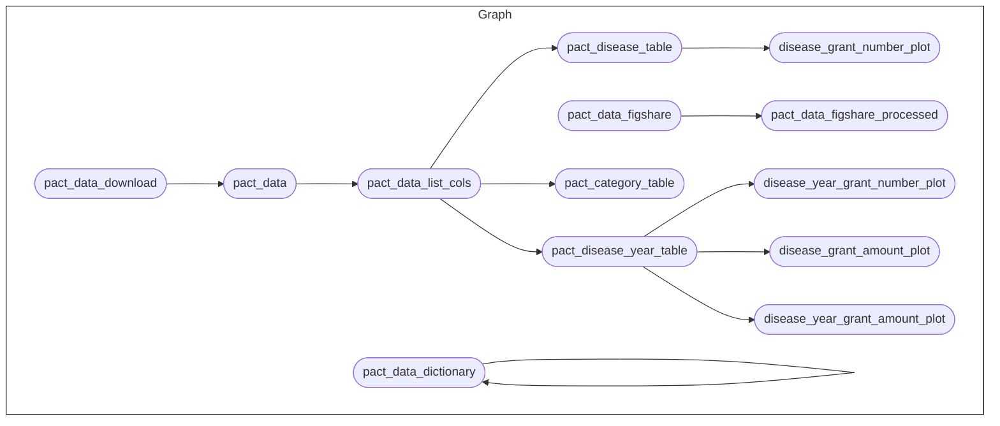

<!-- README.md is generated from README.Rmd. Please edit that file -->

# Pandemic PACT Research

<!-- badges: start -->

[-GPL3.0-blue.svg)](https://opensource.org/licenses/gpl-3.0.html)
-CC0-blue)
[](https://github.com/OxfordIHTM/pandemic-pact-research/actions/workflows/test-targets-workflow.yml)
<!-- badges: end -->

This repository is a
[`docker`](https://www.docker.com/get-started)-containerised,
[`{targets}`](https://docs.ropensci.org/targets/)-based,
[`{renv}`](https://rstudio.github.io/renv/articles/renv.html)-enabled
[`R`](https://cran.r-project.org/) workflow for analysing the [Pandemic
PACT](https://www.pandemicpact.org/) dataset.

## About the Project

The [Pandemic PACT](https://www.pandemicpact.org/) monitors and analyses
global funding and research evidence related to diseases with pandemic
potential, as well as broader research preparedness efforts, and is
equipped to pivot in response to outbreaks. It collects, curates, codes,
and analyses data in alignment with WHO priority diseases and other
selected illnesses, including pandemic influenza, mpox, and plague.
Pandemic PACT aims to guide policy and decision-making for research
funders, policymakers, researchers, multilateral agencies. The Pandemic
PACT data is publicly available for download from its
[website](https://www.pandemicpact.org/) and from
[Figshare](https://portal.sds.ox.ac.uk/pandemicpact).

This project utilises the publicly-available Pandemic PACT dataset to
perform analytics and research relevant to pandemic preparedness.

## Repository Structure

The project repository is structured as follows:

    pandemic-pact-research
        |-- .github/
        |-- data/
        |-- data-raw/
        |-- outputs/
        |-- R/
        |-- reports
        |-- renv
        |-- renv.lock
        |-- .Rprofile
        |-- packages.R
        |-- _targets.R

  - `.github` contains project testing and automated deployment of
    outputs workflows via continuous integration and continuous
    deployment (CI/CD) using Github Actions.

  - `data/` contains intermediate and final data outputs produced by the
    workflow.

  - `data-raw/` contains raw datasets, usually either downloaded from
    source or added manually, that are used in the project.

  - `outputs/` contains compiled reports and figures produced by the
    workflow.

  - `R/` contains functions developed/created specifically for use in
    this workflow.

  - `reports/` contains literate code for R Markdown and/or Quarto
    reports rendered in the workflow.

  - `renv/` contains `renv` package specific files and directories used
    by the package for maintaining R package dependencies within the
    project. The directory `renv/library`, is a library that contains
    all packages currently used by the project. This directory, and all
    files and sub-directories within it, are all generated and managed
    by the `renv` package. Users should not change/edit these manually.

  - `renv.lock` file is the `renv` lockfile which records enough
    metadata about every package used in this project that it can be
    re-installed on a new machine. This file is generated by the `renv`
    package and should not be changed/edited manually.

  - `.Rprofile` file is a project R profile generated when initiating
    `renv` for the first time. This file is run automatically every time
    R is run within this project, and `renv` uses it to configure the R
    session to use the `renv` project library.

  - `packages.R` file lists out all R package dependencies required by
    the workflow.

  - `_targets.R` file defines the steps in the workflow’s data ingest,
    data processing, data analysis, and reporting pipeline.

## Reproducibility

### R package dependencies

This project was built using `R 4.4.1`. This project uses the `renv`
framework to record R package dependencies and versions. Packages and
versions used are recorded in `renv.lock` and code used to manage
dependencies is in `renv/` and other files in the root project
directory.

On starting an R session in the working directory, run:

``` r
renv::restore()
```

to install R package dependencies.

### The workflow


